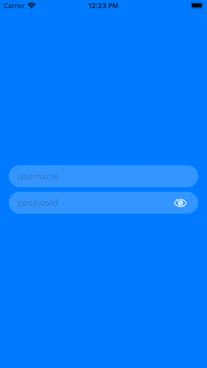

# Custom TextField View SwiftUI

Login screen UI demo.
View with two custom textfields. 
The selected textfield becomes bordered.
Eye icon makes textfield secured.
Tap the area out of textfield to hide keyboard

